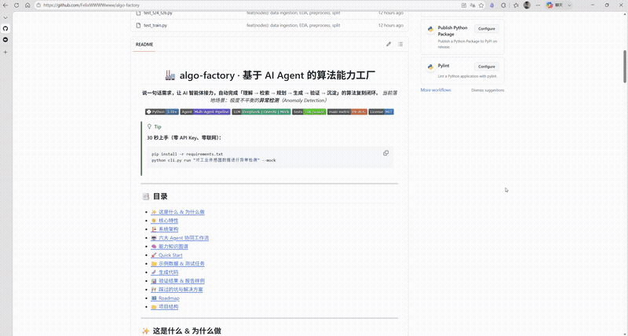
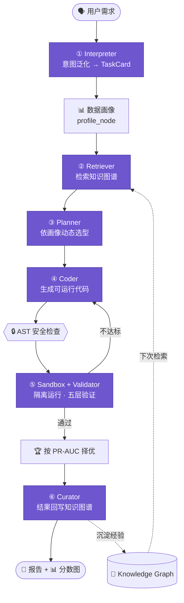

<div align="center">

# 🏭 algo-factory · 基于 AI Agent 的算法能力工厂

**说一句话需求，让 AI 智能体接力，自动完成「理解 → 检索 → 规划 → 生成 → 验证 → 沉淀」的算法复刻闭环。**
_当前落地场景：极度不平衡的**异常检测**（Anomaly Detection）_

**简体中文** ｜ **[English](README_EN.md)**

<!-- Badges -->


</div>

> [!TIP]
> **30 秒上手（零 API Key、零联网）：**
> ```bash
> pip install -r requirements.txt
> python cli.py run "对工业传感器数据进行异常检测" --mock
> ```

<div align="center">

<!-- 📽️ 把你的录屏改名为 demo.gif 放到 docs/demo/ 目录，下面这张图就会自动显示 -->


<sub>▲ 12× 加速预览：一句话需求 → 多智能体自动生成、验证、择优、图谱自进化</sub><br/>
<sub>🎬 完整演示（约 3 分钟，含语音讲解）↓</sub>

</div>

https://github.com/user-attachments/assets/1c0c2a5a-d7d6-42e5-aec2-72309b9109af

---

## 📑 目录

- [✨ 这是什么 & 为什么做](#-这是什么--为什么做)
- [🌟 核心特性](#-核心特性)
- [🏗️ 系统架构](#️-系统架构)
- [🤖 六大 Agent 协同工作流](#-六大-agent-协同工作流)
- [🧠 能力知识图谱](#-能力知识图谱)
- [🚀 快速启动](#-快速启动)
- [📁 示例数据 & 测试任务](#-示例数据--测试任务)
- [🧬 生成代码](#-生成代码)
- [📊 验证结果 & 报告样例](#-验证结果--报告样例)
- [🧗 踩过的坑与解决方案](#-踩过的坑与解决方案)
- [🗺️ 后续可扩展方向](#-后续可扩展方向)
- [📂 项目结构](#-项目结构)

---

## ✨ 这是什么 & 为什么做

在真实行业里，算法能力散落在业务文档、历史代码、专家经验和实验报告中。`algo-factory` 是一个**原型平台**，用一群协作的 AI Agent，把「一句自然语言需求」自动变成「可运行、经验证、可沉淀的算法代码」。

**为什么选异常检测作为落地场景？** 因为它天然自带一堆的工程陷阱，最能考验系统的算法理解深度：

- **极度不平衡**：异常通常只占 1%~5%，一个啥也不干、全判"正常"的废模型，`accuracy` 也能到 98%。
- **评价指标是坑**：因此本项目**全程以 PR-AUC / F1(anomaly) 为主指标，并在代码层显式禁用 accuracy 选模**。
- **标签方向反转**：`scikit-learn` 的 `predict()` 用 `-1` 表示异常、`1` 表示正常，与直觉相反，评估前必须映射。
- **无监督/弱标签**：很多场景没有标签，系统需自动降级到 Top-K 人工审阅路径。

一句话目标：**验证「能力抽取 → 能力复刻 → 能力验证 → 能力沉淀」核心闭环的可行性。**

---

## 🌟 核心特性

| | 特性 | 说明                            |
|---|---|-------------------------------|
| 🤖 | **多智能体协作** | 6 个职责单一的 Agent 接力，而非单次 prompt 生成代码 |
| 🧬 | **LLM 驱动（非硬编码）** | 意图泛化（CoT 解析任意场景）· 动态选型（依数据画像推荐算法）· 零样本代码生成 |
| 🏆 | **多方案自动竞技** | 依数据画像动态推荐 2-3 个算法同台 **（不限固定池）**，按 PR-AUC 择优 |
| 🔒 | **沙箱安全执行** | 生成代码经 AST 安全扫描后，在隔离子进程中运行，超时硬熔断 |
| 🔁 | **失败自动修复** | 验证不通过 → 带"负面约束"退回重写，最多 N 轮    |
| 🧠 | **知识图谱自沉淀** | 每次结果（含失败案例）回写图谱，越用越聪明         |
| 🔁 | **图谱自进化 · 画像感知学习** | 失败连同**数据画像**一起沉淀；仅当画像相似才规避该算法 |
| 🔌 | **三种交互入口** | CLI / Streamlit Web UI / FastAPI，一套内核全覆盖 |
| 🎭 | **Mock / Real 无缝切换** | 无 API Key 也能全链路演示；接 DeepSeek 即真实推理 |
| ✅ | **113 个测试护航** | 单元 / 集成 / 端到端 / 边界 / 学习闭环用例全绿 |

---

## 🏗️ 系统架构

一条自然语言需求，流经六个工位，产出「代码 + 报告 + 图谱更新」：



**贯穿全程的「工单」**：一个 `TaskState` 对象（见 `factory/state.py`）像流转单一样在各工位间传递，每个 Agent 只往里写自己那部分，最终它本身就是完整的成品档案。全程 JSON 可序列化，UI 与后端零耦合。

---

## 🤖 六大 Agent 协同工作流

| # | Agent | 职能类比 | 输入 → 输出 | 关键实现 |
|---|---|---|---|---|
| ① | **Interpreter** | 产品经理 | 任意场景需求 → `TaskCard`（CoT 解析 anomaly_subtype / 约束 / 指标取向） | LLM 思维链解析 + 关键字兜底 |
| ② | **Retriever** | 图书管理员 | `TaskCard` → 相似能力 / 教训 / **失败案例** | 图谱按 `task_type` 检索 |
| ③ | **Planner** | 架构师 | `TaskCard` + **数据画像** → 动态推荐 2-3 个算法（含超参空间） | LLM 依 `data_profile` 选型，**废除固定池** |
| ④ | **Coder** | 程序员 | 方案 → 可运行 Python（`def run(data_path)->dict`） | LLM **零样本现写**；模板降级为 N 次失败后的兜底拦截器 |
| ⑤ | **Validator** | 质检员 | 代码 → 五层验证报告 | 语法→安全→能跑→达标→签名 |
| ⑥ | **Curator** | 档案管理员 | 验证结果 → 图谱节点/边 | 成功/失败双写，失败沉淀为 `FailureCase` |

> [!NOTE]
> **图谱增强的核心卖点**：Retriever 会**主动把历史 `FailureCase`（如"用 accuracy 选模导致废模型"）纳入上下文**，让 Planner 提前规避已知的坑——这就是"失败经验可复用"。

> [!NOTE]
> **`--real` 才是完全体**：Mock 模式用预制/模板离线演示；接入真实 LLM 后，Planner 依数据画像推荐**未预设算法**（如 ECOD / EllipticEnvelope），Coder 为其**从零现写代码**，`train_node` 按 `import_path` 动态加载执行——LLM 从"装饰"变为"承重"。提示词见 `factory/llm/prompts/*.jinja2`。

---

## 🧠 能力知识图谱

采用 **NetworkX `MultiDiGraph`** 内存图（无需 Neo4j，零部署成本），支持 `save()` / `load()` JSON 与 `export_graphml()` 可视化。

### Schema（结合异常检测场景）

**节点类型（Node）**

| 节点 | 含义 | 异常检测场景示例 |
|---|---|---|
| `Capability` | 一项算法能力 | 工业传感器异常检测 |
| `Algorithm` | 具体算法 | IsolationForest / LOF / OneClassSVM |
| `Metric` | 评价指标 | PR-AUC / F1 / Recall |
| `Dependency` | 依赖环境 | scikit-learn / pyod |
| `Dataset` | 数据集画像 | 异常占比 2%、8 维传感器 |
| `ValidationRun` | 一次验证记录 | pr_auc=1.0, status=passed |
| `FailureCase` | 失败案例 | pr_auc=0.0587 < 阈值 0.6 |
| `Lesson` | 可复用教训 | 距离类模型须先标准化 |

**边类型（Edge）**：`USES_ALGORITHM` · `EVALUATED_BY` · `REQUIRES` · `VALIDATED_IN` · `CAUSED_LESSON`

### 真实示例（一次运行后 `data/knowledge_graph.json` 的片段）

```json
{
  "nodes": {
    "capability:anomaly_detection": {
      "type": "Capability", "task_type": "anomaly_detection",
      "target": "industrial_sensor_data"
    },
    "validationrun:task_20260717_102318:v3": {
      "type": "ValidationRun", "status": "passed", "pr_auc": 0.8286, "f1": 0.7692
    },
    "failurecase:task_20260717_102318:v2": {
      "type": "FailureCase", "reason": "pr_auc=0.0587 < 阈值 0.6"
    }
  },
  "edges": [
    { "source": "capability:anomaly_detection", "target": "algorithm:Isolation Forest 方案", "edge_type": "USES_ALGORITHM" },
    { "source": "validationrun:task_20260717_102318:v2", "target": "failurecase:task_20260717_102318:v2", "edge_type": "CAUSED_LESSON" }
  ]
}
```

### 🔁 从失败中学习（自进化 · 可复现验证）

系统把失败写成 `FailureCase` 与可复用的 `Lesson` 节点；下次同类任务，Retriever 从图谱检索到这些教训，Planner 据此**主动降级历史失败算法**。

一条命令即可现场验证（`demo_second_run.py`）：

```bash
python demo_second_run.py
```

```text
第 1 次运行（图谱空白，无先验）
    1. IsolationForest     [正常提出]
    2. LocalOutlierFactor  [正常提出]
    3. OneClassSVM         [正常提出]

第 2 次运行（已加载图谱，携带上次失败经验）
    1. IsolationForest     [正常提出]
    2. LocalOutlierFactor  [⚠️ 历史失败已规避]
    3. OneClassSVM         [⚠️ 历史失败已规避]
```

> 第一次三方案平起平坐；第二次系统从知识图谱检索到 LOF / OCSVM 的失败，**主动标注并降级**——这就是"能力沉淀 → 复用"的闭环，可复现、可验证。

> **🧠 画像感知升级**：失败经验会连同当时的**数据画像**（维度、异常占比、量纲、**异常紧致度**等）一起沉淀；Retriever 仅当**当前数据画像相似**（如"异常同样聚成致密簇"）时才规避该算法。`demo_second_run.py` 第 3 次运行即演示此点。
>
> 想重新演示"从零学习"，一键清空大脑：`python cli.py reset`（回到空白，下次从头再学）。

---

## 🚀 快速启动

### 环境要求

- Python **3.10+**
- 依赖见 `requirements.txt`（scikit-learn / pandas / networkx / streamlit / fastapi / jinja2 …）

### 安装

```bash
git clone <your-repo-url> && cd algo-factory
python -m venv .venv
# Windows: .venv\Scripts\activate   |   macOS/Linux: source .venv/bin/activate
pip install -r requirements.txt
```

### 三种启动方法

```bash
# 1) 命令行；--data 可喂自定义 CSV
python cli.py run "对工业传感器数据进行异常检测" --mock/real
python cli.py run "对工业传感器数据进行异常检测" --mock/real --data data/synth/demo_hard.csv

# 2) Web 界面（演示首选：Run 上传 CSV / Graph / History 三个标签页）
streamlit run app.py

# 3) HTTP API
uvicorn api:app --port 8000
# curl -X POST http://127.0.0.1:8000/run -F 'query=对传感器数据异常检测' -F 'mock=true' -F 'file=@data/synth/demo_hard.csv'
```

> 三种入口共用同一套内核（`Pipeline.run`），产出一致；均支持喂自定义 CSV（CLI `--data` / Web 上传 / API `file`），均写入 History。

### 接入真实大模型（DeepSeek 示例）

```powershell
$env:DEEPSEEK_API_KEY = "sk-xxxx"
$env:OPENAI_BASE_URL  = "https://api.deepseek.com"
# 模型默认 deepseek-v4-pro；如需切换：$env:OPENAI_MODEL="deepseek-v4-flash"
python cli.py run "对工业传感器数据进行异常检测" --real
```

> [!IMPORTANT]
> **Mock 模式（无需API）**，全链路（6 Agent + 沙箱 + 图谱）均可零依赖离线跑通。

---

## 📁 示例数据 & 测试任务

- **合成数据生成器**：`factory/nodes/split.py::make_synthetic_dataset()`
  正常样本服从多元正态；异常样本按 `2~3` 个簇偏移 `3~6σ` 注入，比例可控（默认 2%，强制落在 `[0.5%, 15%]` 合理区间，防止退化成普通二分类）。
- **自带测试任务**：`"对工业传感器数据进行异常检测"`（无标签则走无监督 Top-K 路径）。
- **上传你自己的 CSV**：Streamlit `Run` 页可上传；**含 `label` 列（1=异常 / 0=正常）** 即自动计算监督指标，否则输出 Top-K 最可疑样本供人工审阅。

---

## 🧬 生成代码

Coder 产出的代码遵守统一 **IPC 协议**，便于沙箱抓取指标：

- 函数签名固定：`def run(data_path: str) -> dict`
- 结尾必打印：`print("RESULT_JSON:" + json.dumps(metrics))`
- `-1/1` 标签**必须映射**为 `1/0`

```python
import json, numpy as np, pandas as pd
from sklearn.ensemble import IsolationForest
from sklearn.metrics import average_precision_score, f1_score, precision_score, recall_score

def run(data_path: str) -> dict:
    df = pd.read_csv(data_path)
    y_true = df.pop("label").values if "label" in df.columns else None
    X = df.values.astype(float)

    model = IsolationForest(contamination=0.02, random_state=42).fit(X)
    scores = -model.decision_function(X)              # 越大越可疑
    y_pred = (model.predict(X) == -1).astype(int)     # -1→1(异常), 1→0(正常)

    result = {"n_anomalies_detected": int(y_pred.sum())}
    if y_true is not None:
        result["pr_auc"]    = round(float(average_precision_score(y_true, scores)), 4)
        result["f1"]        = round(float(f1_score(y_true, y_pred, zero_division=0)), 4)
        result["precision"] = round(float(precision_score(y_true, y_pred, zero_division=0)), 4)
        result["recall"]    = round(float(recall_score(y_true, y_pred, zero_division=0)), 4)
    print("RESULT_JSON:" + json.dumps(result))
    return result
```

> LOF 与 One-Class SVM 走同一模板（自动加 `StandardScaler`、`novelty=True` / `nu` 等差异项）。

---

## 📊 验证结果 & 报告样例

每次运行自动产出 `reports/{task_id}.md` + `reports/{task_id}_scores.png`（异常分数分布图）。

**五层验证器**（`factory/sandbox/validator.py`）+ 可插拔阈值配置 `data/configs/validation/anomaly_detection.yaml`：

```yaml
required_metrics: [pr_auc, f1, precision, recall]
thresholds:
  pr_auc: 0.60      # 极不平衡下放宽；不达标 → 触发修复 → 失败沉淀为 FailureCase
  f1: 0.40
required_signature: "run(data_path: str) -> dict"
timeout_sec: 60
```

**三方案对比样例**（真实运行输出，按 PR-AUC 排序）：

| 方案 | 算法 | PR-AUC | F1 | Precision | Recall | 状态 |
|---|---|---|---|---|---|---|
| Isolation Forest 方案 | `IsolationForest` | **1.0000** | 1.0000 | 1.0000 | 1.0000 | ✅ passed |
| One-Class SVM 方案 | `OneClassSVM` | 0.8286 | 0.7692 | 0.7407 | 0.8000 | ✅ passed |
| LOF 方案 | `LocalOutlierFactor` | 0.0587 | 0.0429 | 0.0462 | 0.0400 | ❌ failed |

> LOF 在该数据分布上翻车 → 被记为 `FailureCase` 回写图谱，正是"失败可沉淀"的活教材。

---

## 🧗 踩过的坑与解决方案

| 坑 | 症状 | 解决方案 |
|---|---|---|
| 用 accuracy 选模 | 全判正常也能 98%，选出废模型 | 主指标锁定 **PR-AUC**，评估层显式禁用 accuracy 排序 |
| 标签方向反转 | Precision/Recall 接近 0 | 统一映射 `(pred == -1).astype(int)`，并写单测回归 |
| 距离类模型漏标准化 | OCSVM/LOF 指标崩 | 预处理按算法族分支，距离/密度类强制 `StandardScaler` |
| 误用 SMOTE 过采样 | 破坏异常稀有性先验 | 全流程禁用过采样 |
| 生成代码不可信 | 可能含 bug / 危险操作 | AST 安全扫描 + 子进程沙箱 + 超时熔断 |
| LLM 输出非结构化 | JSON 解析失败 | `json_repair` 修复 + Pydantic 校验 + 重试 |
| 跨平台编码 | Windows 默认 GBK 写图谱 → 读取乱码 | 所有文件 I/O 显式 `encoding="utf-8"` |

---

## 🗺️ 后续可扩展方向

- [ ] 接入 `pyod` 的 ECOD / COPOD / AutoEncoder 深度异常检测
- [ ] Planner 引入 Beam Search / MCTS 做方案搜索
- [ ] 跨场景迁移：同一框架复用于文本分类 / 表格分类（`validation/*.yaml` 插件化已预留）
- [ ] 时序 / 流式异常检测
- [x] 知识图谱自进化（**画像感知**）：失败连同数据画像沉淀，仅相似数据才规避（见 `demo_second_run.py`）
- [ ] 知识图谱 PyVis 交互式可视化
- [ ] 从真实代码仓库自动抽取函数与依赖

---

## 📂 项目结构

```text
algo-factory/
├── factory/
│   ├── state.py            # 🧾 TaskState：贯穿全程的“工单”
│   ├── pipeline.py         # 🎛️ 主编排：串起 6 Agent + 沙箱 + 图谱 + 报告
│   ├── report.py           # 📄 报告 + 异常分数图
│   ├── agents/             # 🤖 6 个 Agent + 基类 + 工具
│   ├── nodes/              # 🔧 数据/模型节点：ingestion/preprocess/split/train/evaluate
│   ├── sandbox/            # 🔒 runner(子进程) / security(AST) / validator(五层)
│   ├── graph/              # 🧠 schema / store(NetworkX) / extract
│   └── llm/                # ☎️ client / openai_client / mock_client / structured / prompt_manager
├── data/
│   ├── synth/              # 合成数据    · configs/validation/  验证阈值 YAML
│   ├── examples/           # 生成的代码样品 · logs/  运行日志
│   └── docs/               # 领域知识文档
├── reports/                # 📊 报告 + 分数图
├── tests/ & test_*.py      # ✅ 113 个测试
├── app.py                  # 🖥️ Streamlit UI     api.py  🔌 FastAPI     cli.py  🎮 CLI
└── requirements.txt
```

---

<div align="center">

**如果这个项目对你有启发，欢迎 ⭐ Star。**

</div>
