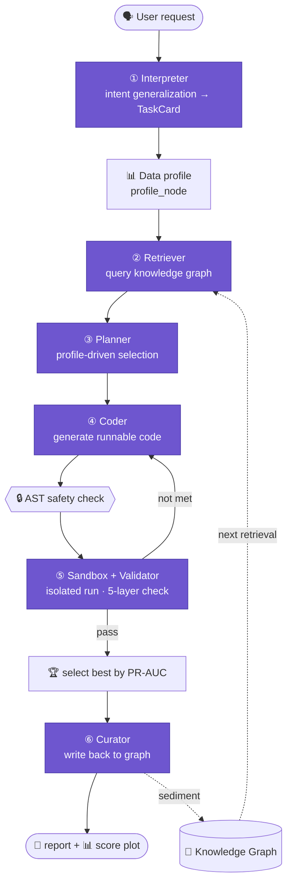

<div align="center">

# 🏭 algo-factory · An AI-Agent Algorithm Capability Factory

**Describe a need in one sentence; a team of AI agents relays it through “Understand → Retrieve → Plan → Generate → Validate → Sediment” to reproduce a runnable, validated algorithm — automatically.**
_Current landing scenario: extremely imbalanced **Anomaly Detection**_

**[简体中文](README.md)** ｜ **English**

<!-- Badges -->


</div>

> [!TIP]
> **Up and running in 30 seconds (no API key, no network):**
> ```bash
> pip install -r requirements.txt
> python cli.py run "detect anomalies in industrial sensor data" --mock
> ```

<div align="center">


<sub>▲ 12× sped-up preview: one-sentence need → multi-agent generation, validation, selection, self-evolving graph</sub><br/>
<sub>🎬 Full walkthrough (~3 min, with narration) ↓</sub>

</div>

https://github.com/user-attachments/assets/1c0c2a5a-d7d6-42e5-aec2-72309b9109af

---

## 📑 Table of Contents

- [✨ What & Why](#-what--why)
- [🌟 Key Features](#-key-features)
- [🏗️ Architecture](#️-architecture)
- [🤖 Six-Agent Workflow](#-six-agent-workflow)
- [🧠 Capability Knowledge Graph](#-capability-knowledge-graph)
- [🚀 Quick Start](#-quick-start)
- [📁 Sample Data & Test Task](#-sample-data--test-task)
- [🧬 Generated Code](#-generated-code)
- [📊 Validation & Report](#-validation--report)
- [🧗 Pitfalls & Fixes](#-pitfalls--fixes)
- [🗺️ Roadmap](#️-roadmap)
- [📂 Project Layout](#-project-layout)

---

## ✨ What & Why

In the real world, algorithm know-how is scattered across business docs, legacy code, expert experience and experiment reports. `algo-factory` is a **prototype platform** that uses a team of collaborating AI agents to turn *a single natural-language request* into *runnable, validated, and re-usable algorithm code*.

**Why anomaly detection?** Because it is packed with engineering traps that stress-test how deeply the system actually understands ML:

- **Extreme imbalance** — anomalies are usually only 1%–5%. A do-nothing model that predicts “normal” for everything still scores 98% `accuracy`.
- **The metric is a trap** — hence this project uses **PR-AUC / F1(anomaly) as the primary metric and explicitly forbids accuracy-based model selection**.
- **Label direction is reversed** — `scikit-learn`’s `predict()` returns `-1` for anomaly and `1` for normal (counter-intuitive); it must be mapped before evaluation.
- **Unsupervised / weak labels** — many datasets have no labels, so the system gracefully degrades to a Top-K human-review path.

One-line goal: **prove the feasibility of the “capability extraction → reproduction → validation → sedimentation” closed loop.**

---

## 🌟 Key Features

| | Feature | Description |
|---|---|---|
| 🤖 | **Multi-agent collaboration** | 6 single-responsibility agents relay a task, instead of a one-shot prompt |
| 🧬 | **LLM-driven (no hard-coding)** | Intent generalization (CoT) · dynamic algorithm selection (from the data profile) · zero-shot code generation |
| 🏆 | **Automatic multi-plan bake-off** | 2–3 algorithms recommended from the data profile **(no fixed pool)**, ranked by PR-AUC |
| 🔒 | **Sandboxed execution** | Generated code passes an AST safety scan, then runs in an isolated subprocess with a hard timeout |
| 🔁 | **Self-repair loop** | On failure → regenerate with “negative constraints”, up to N rounds |
| 🧠 | **Self-sedimenting knowledge graph** | Every result (including failures) is written back to the graph — it gets smarter over time |
| 🔁 | **Self-evolving · profile-aware learning** | Failures are stored *with the data profile*; an algorithm is only avoided when the profile is similar — swap datasets and it gets a fresh shot (`demo_second_run.py`) |
| 🔌 | **Three entry points** | CLI / Streamlit Web UI / FastAPI, one shared core |
| 🎭 | **Seamless Mock / Real switch** | Runs end-to-end with no API key; plug in DeepSeek for real inference |
| ✅ | **113 tests** | Unit / integration / end-to-end / boundary / learning-loop, all green |

---

## 🏗️ Architecture

One natural-language request flows through six stations and produces *code + report + graph update*:



**The travelling “work order”**: a single `TaskState` object (see `factory/state.py`) is passed between stations; each agent writes only its own part, and in the end the object *is* the complete record. It stays JSON-serializable throughout, decoupling the UI from the backend.

---

## 🤖 Six-Agent Workflow

| # | Agent | Analogy | Input → Output | Key implementation |
|---|---|---|---|---|
| ① | **Interpreter** | Product manager | Any-domain request → `TaskCard` (CoT parses anomaly_subtype / constraints / metric priority) | LLM chain-of-thought + keyword fallback |
| ② | **Retriever** | Librarian | `TaskCard` + **data profile** → similar capabilities / lessons / **failure cases** | Profile-aware graph query |
| ③ | **Planner** | Architect | `TaskCard` + **data profile** → 2–3 algorithms (with hyper-parameter space) | LLM selects from `data_profile`, **no fixed pool** |
| ④ | **Coder** | Programmer | Plan → runnable Python (`def run(data_path)->dict`) | LLM **writes from scratch**; template is a last-resort interceptor after N failures |
| ⑤ | **Validator** | QA inspector | Code → 5-layer validation report | syntax → security → runs → thresholds → signature |
| ⑥ | **Curator** | Archivist | Validation results → graph nodes/edges | writes both success & failure; failures become `FailureCase` |

> [!NOTE]
> **The core selling point**: the Retriever proactively surfaces historical `FailureCase`s so the Planner can avoid known traps — that is “reusable failure experience”.

> [!NOTE]
> **`--real` is the full experience**: Mock mode uses canned/template output for offline demos. With a real LLM, the Planner may recommend **non-preset algorithms** (e.g. ECOD / EllipticEnvelope), the Coder **writes their code from scratch**, and `train_node` **dynamically imports** them via `import_path` — the LLM shifts from decoration to load-bearing. Prompts live in `factory/llm/prompts/*.jinja2`.

---

## 🧠 Capability Knowledge Graph

Backed by an in-memory **NetworkX `MultiDiGraph`** (no Neo4j, zero deployment cost), with `save()` / `load()` JSON and `export_graphml()`.

### Schema (for anomaly detection)

| Node | Meaning | Example |
|---|---|---|
| `Capability` | An algorithm capability | Industrial-sensor anomaly detection |
| `Algorithm` | A concrete algorithm | IsolationForest / LOF / OneClassSVM |
| `Metric` | Evaluation metric | PR-AUC / F1 / Recall |
| `Dependency` | Runtime dependency | scikit-learn / pyod |
| `Dataset` | Dataset profile | 2% anomalies, 8 sensor dims |
| `ValidationRun` | One validation record | pr_auc=1.0, status=passed |
| `FailureCase` | A failure (with data profile) | pr_auc=0.0587 < threshold 0.6 |
| `Lesson` | A reusable lesson | distance-based models need StandardScaler |

**Edges**: `USES_ALGORITHM` · `EVALUATED_BY` · `REQUIRES` · `VALIDATED_IN` · `CAUSED_LESSON` · `HAS_LESSON`

### 🔁 Learning from Failure (self-evolving · reproducible)

Failures are written as `FailureCase` and reusable `Lesson` nodes. On the next similar task, the Retriever surfaces them and the Planner **demotes the historically-failed algorithm**.

```bash
python demo_second_run.py
```

```text
Run #1 (empty graph, no prior)
    1. IsolationForest     [proposed]
    2. LocalOutlierFactor  [proposed]
    3. OneClassSVM         [proposed]

Run #2 (graph loaded, carries prior failures)
    1. IsolationForest     [proposed]
    2. LocalOutlierFactor  [⚠️ avoided — prior failure]
    3. OneClassSVM         [⚠️ avoided — prior failure]

Run #3 (a DIFFERENT dataset, different profile)
    1. IsolationForest     [proposed]
    2. LocalOutlierFactor  [proposed]   ← fresh chance
    3. OneClassSVM         [proposed]
```

> **🧠 Profile-aware upgrade**: each failure is stored together with its **data profile** (dims, anomaly ratio, scale disparity, **anomaly compactness**, …). The Retriever avoids an algorithm **only when the current profile is similar** (e.g. “anomalies also form a dense cluster”). Feed a differently-shaped dataset and LOF gets a fresh chance to win — no “once bitten, twice shy”. Run #3 in `demo_second_run.py` demonstrates exactly this.
>
> To demo learning from scratch, wipe the brain first: `python cli.py reset`.

---

## 🚀 Quick Start

**Requirements**: Python **3.10+**; deps in `requirements.txt` (scikit-learn / pandas / networkx / streamlit / fastapi / jinja2 …).

```bash
git clone <your-repo-url> && cd algo-factory
python -m venv .venv
# Windows: .venv\Scripts\activate   |   macOS/Linux: source .venv/bin/activate
pip install -r requirements.txt
```

### Three ways to run

```bash
# 1) CLI; --data feeds a custom CSV
python cli.py run "detect anomalies in industrial sensor data" --mock
python cli.py run "detect anomalies in industrial sensor data" --mock --data data/synth/demo_hard.csv

# 2) Web UI (best for demos: Run / Graph / History tabs, CSV upload)
streamlit run app.py

# 3) HTTP API
uvicorn api:app --port 8000
# curl -X POST http://127.0.0.1:8000/run -F 'query=detect anomalies' -F 'mock=true' -F 'file=@data/synth/demo_hard.csv'
```

> All three share the same core (`Pipeline.run`) and produce identical results; all accept a custom CSV (CLI `--data` / Web upload / API `file`) and write to History.
>
> 🧹 Want to demo the learning process again? `python cli.py reset` wipes the knowledge graph (blank-slate brain).

### Plug in a real LLM (DeepSeek example)

```powershell
$env:DEEPSEEK_API_KEY = "sk-xxxx"
$env:OPENAI_BASE_URL  = "https://api.deepseek.com"
# default model deepseek-v4-pro; override with $env:OPENAI_MODEL="deepseek-v4-flash"
python cli.py run "detect anomalies in industrial sensor data" --real
```

> [!IMPORTANT]
> **Mock mode needs no API key** — the full chain (6 agents + sandbox + graph) runs offline with zero external dependencies.

---

## 📁 Sample Data & Test Task

- **Synthetic generator**: `factory/nodes/split.py::make_synthetic_dataset()` — normals are multivariate-normal; anomalies are injected as `2~3` clusters shifted `3~6σ`, ratio configurable (default 2%, clamped to `[0.5%, 15%]` to avoid degenerating into ordinary binary classification).
- **Built-in task**: `"detect anomalies in industrial sensor data"` (no label → unsupervised Top-K path).
- **Bring your own CSV**: upload on the Streamlit `Run` tab; with a `label` column (1=anomaly / 0=normal) supervised metrics are computed, otherwise it outputs the Top-K most suspicious rows for review.

---

## 🧬 Generated Code

Generated code follows a fixed **IPC contract** so the sandbox can capture metrics:

- Signature: `def run(data_path: str) -> dict`
- Must print at the end: `print("RESULT_JSON:" + json.dumps(metrics))`
- `-1/1` labels **must be mapped** to `1/0`

```python
import json, numpy as np, pandas as pd
from sklearn.ensemble import IsolationForest
from sklearn.metrics import average_precision_score, f1_score, precision_score, recall_score

def run(data_path: str) -> dict:
    df = pd.read_csv(data_path)
    y_true = df.pop("label").values if "label" in df.columns else None
    X = df.values.astype(float)

    model = IsolationForest(contamination=0.02, random_state=42).fit(X)
    scores = -model.decision_function(X)              # higher = more suspicious
    y_pred = (model.predict(X) == -1).astype(int)     # -1→1 (anomaly), 1→0 (normal)

    result = {"n_anomalies_detected": int(y_pred.sum())}
    if y_true is not None:
        result["pr_auc"]    = round(float(average_precision_score(y_true, scores)), 4)
        result["f1"]        = round(float(f1_score(y_true, y_pred, zero_division=0)), 4)
        result["precision"] = round(float(precision_score(y_true, y_pred, zero_division=0)), 4)
        result["recall"]    = round(float(recall_score(y_true, y_pred, zero_division=0)), 4)
    print("RESULT_JSON:" + json.dumps(result))
    return result
```

---

## 📊 Validation & Report

Each run auto-produces `reports/{task_id}.md` + `reports/{task_id}_scores.png` (anomaly-score histogram).

**5-layer validator** (`factory/sandbox/validator.py`) + pluggable thresholds `data/configs/validation/anomaly_detection.yaml`:

```yaml
required_metrics: [pr_auc, f1, precision, recall]
thresholds:
  pr_auc: 0.60      # relaxed for imbalance; if not met → repair → sediment as FailureCase
  f1: 0.40
required_signature: "run(data_path: str) -> dict"
timeout_sec: 60
```

**Three-plan bake-off (real output, ranked by PR-AUC):**

| Plan | Algorithm | PR-AUC | F1 | Precision | Recall | Status |
|---|---|---|---|---|---|---|
| Isolation Forest | `IsolationForest` | **0.9995** | 1.0000 | 1.0000 | 1.0000 | ✅ passed |
| One-Class SVM | `OneClassSVM` | 0.4118 | 0.5294 | 0.5625 | 0.5000 | ❌ failed |
| LOF | `LocalOutlierFactor` | 0.0420 | 0.0429 | 0.0462 | 0.0400 | ❌ failed |

> On dense-cluster anomalies LOF fails → recorded as a `FailureCase` (with the data profile) — a live example of “sedimented failure”. The generated report also explains **why** the winner was chosen and why the others lost.

---

## 🧗 Pitfalls & Fixes

| Pitfall | Symptom | Fix |
|---|---|---|
| Accuracy-based selection | 98% by predicting all-normal → useless model | Lock main metric to **PR-AUC**; forbid accuracy ranking |
| Reversed label direction | Precision/Recall near 0 | Uniform `(pred == -1).astype(int)` mapping + regression test |
| Missing scaling for distance models | OCSVM/LOF collapse | Branch by algorithm family; force `StandardScaler` for distance/density models |
| Misusing SMOTE oversampling | Destroys the rarity prior | Oversampling disabled everywhere |
| Untrusted generated code | may contain bugs / dangerous ops | AST scan + subprocess sandbox + timeout |
| Non-structured LLM output | JSON parse failures | `json_repair` + Pydantic validation + retry |
| Cross-platform encoding | Windows GBK writes graph → garbled reads | Explicit `encoding="utf-8"` on all file I/O |

---

## 🗺️ Roadmap

- [ ] Add `pyod` ECOD / COPOD / AutoEncoder deep detectors
- [ ] Beam Search / MCTS plan search in the Planner
- [ ] Cross-scenario transfer: reuse the framework for text / tabular classification (`validation/*.yaml` already pluggable)
- [ ] Time-series / streaming anomaly detection
- [x] **Profile-aware self-evolution**: failures sediment with the data profile; only avoided on similar data (see `demo_second_run.py`)
- [ ] Interactive PyVis graph visualization
- [ ] Extract functions & dependencies from real code repos

---

## 📂 Project Layout

```text
algo-factory/
├── factory/
│   ├── state.py            # 🧾 TaskState: the travelling work order
│   ├── pipeline.py         # 🎛️ orchestrator: 6 agents + sandbox + graph + report
│   ├── report.py           # 📄 report + score plot
│   ├── agents/             # 🤖 6 agents + base + utils
│   ├── nodes/              # 🔧 profile / ingestion / preprocess / split / train / evaluate
│   ├── sandbox/            # 🔒 runner (subprocess) / security (AST) / validator (5-layer)
│   ├── graph/              # 🧠 schema / store (NetworkX) / extract
│   └── llm/                # ☎️ client / openai_client / mock_client / structured / prompt_manager / prompts
├── data/
│   ├── synth/              # synthetic data (+ gen_demo_hard.py) · configs/validation/ thresholds
│   ├── examples/           # generated code samples · logs/ run logs
│   └── docs/               # domain knowledge docs
├── reports/                # 📊 reports + score plots
├── tests/ & test_*.py      # ✅ 113 tests
├── demo_second_run.py      # 🔁 reproducible “learning from failure” demo
├── app.py                  # 🖥️ Streamlit UI     api.py  🔌 FastAPI     cli.py  🎮 CLI (run / reset)
└── requirements.txt
```

---

<div align="center">

**If this project inspired you, a ⭐ Star is appreciated.**

</div>
