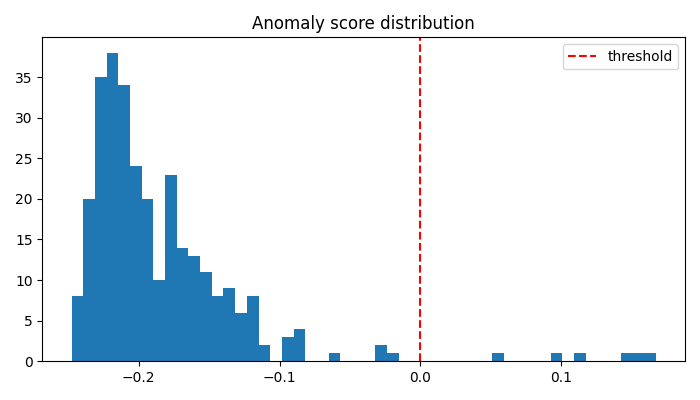

# 异常检测验证报告

- **任务 ID**：task_20260717_092319_84111af9
- **需求**：异常检测
- **场景**：anomaly_detection　**异常占比(EDA)**：0.02
- **最佳模型**：**IsolationForest**（主指标 PR-AUC）

## EDA 摘要
数据集共 5000 行、12 列。疑似异常样本占比约 2.1%，属于极度不平衡场景。缺失率最高列为 'sensor_temp'（8.3%），建议中位数填充。数值列分布整体右偏（75th 分位数与 99th 分位数差距显著），存在明显离群点。推荐主指标 PR-AUC，禁用 accuracy（正常样本主导会导致指标虚高）。

## 方案对比（按 PR-AUC 排序，禁用 accuracy 选优）
| 方案 | 算法 | PR-AUC | F1 | Precision | Recall | 状态 |
|---|---|---|---|---|---|---|
| Isolation Forest 方案 | IsolationForest | 1.0 | 1.0 | 1.0 | 1.0 | passed |
| LOF 方案 | LocalOutlierFactor | 1.0 | 1.0 | 1.0 | 1.0 | passed |
| One-Class SVM 方案 | OneClassSVM | 0.5907 | 0.4923 | 0.4571 | 0.5333 | failed |

## 最优指标
- **pr_auc**：1.0
- **f1**：1.0
- **precision**：1.0
- **recall**：1.0

## Top-K 最可疑样本行号
[70, 279, 12, 160, 243, 51, 27, 211, 78, 59, 235, 198, 294, 222, 254, 231, 67, 20, 257, 237]

> 极不平衡下 accuracy 会因"全判正常"虚高，本报告全程以 PR-AUC / F1(anomaly) 为准。